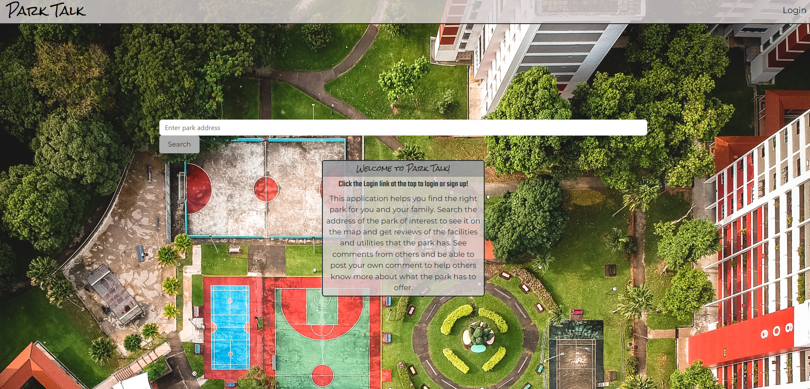
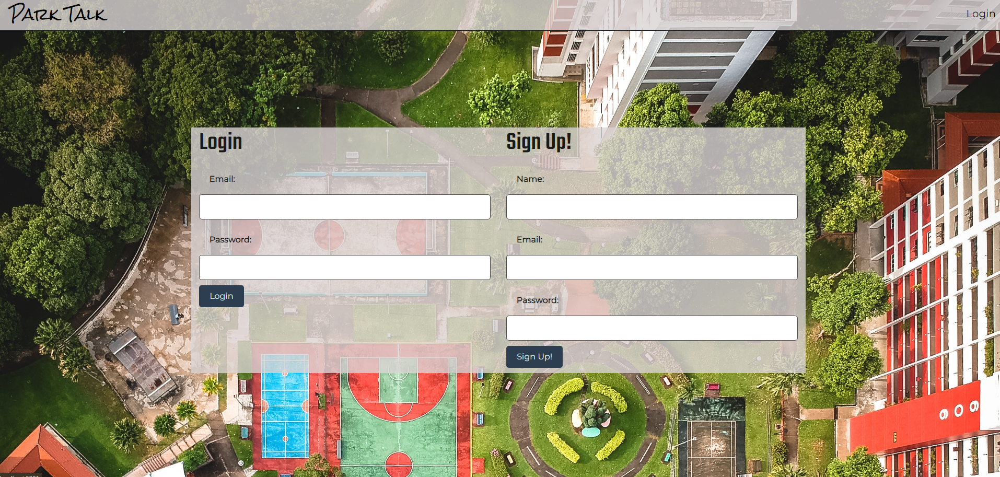
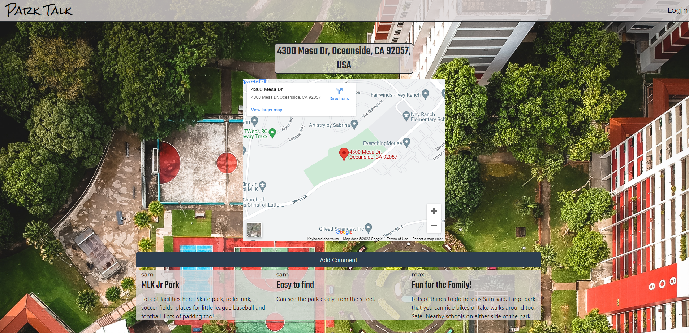
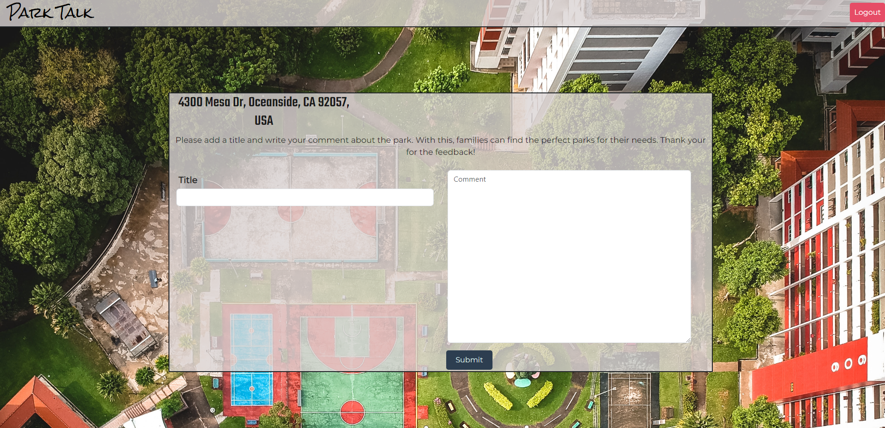

# Park-Talk

## Description

It is a blog site where people can put reviews about parks. It was created so people can have a informed decision when choosing a park to visit. It utilized [MySQL](https://www.mysql.com/) and [sequelize](https://www.npmjs.com/package/sequelize) to handle database, [express-session](https://www.npmjs.com/package/express-session), [connect-session-sequelize](https://www.npmjs.com/package/connect-session-sequelize), and [bcrypt](https://www.npmjs.com/package/bcrypt) to handle login features, and uses [express-handlebars](https://www.npmjs.com/package/express-handlebars) to dynamically build webpages. It also uses google maps api with [axios](https://www.npmjs.com/package/axios) library to handle location data. This application was deployed using [Heroku](https://www.heroku.com/platform).

## Table of Contents

- [Park-Talk](#park-talk)
  - [Description](#description)
  - [Table of Contents](#table-of-contents)
  - [Usage](#usage)
  - [API Reference](#api-reference)
  - [License](#license)
  - [Future Development](#future-development)
  - [Authors](#authors)

## Usage

This url will take you to the homepage. To access all the features, please make sure to login or sign up by clicking the login button on the top right corner. Once logged in, you can search for a park uisng the search bar. Selected park will have review page. Here, clicking on comment button will lead you to comment page. Please input title, choose a facility to comment on, and input comment before clicking submit. Once you are finish using this app, you can log out by clicking the logout button on the top right.

## API Reference

- [Google Maps Embed API](https://console.cloud.google.com/apis/library/maps-embed-backend.googleapis.com?project=circular-hybrid-392804)
- [Google Geocoding API](https://console.cloud.google.com/apis/library/geocoding-backend.googleapis.com?project=circular-hybrid-392804)
## License
  

## Future Development

- Comments to be sorted by facilities
- Increase facilities list
- Implement rating system
- Ability to upload pictures to comments
- Add street view of park address
- Make save feature to make favorite list.

## Authors

- Alex Nguyen [@monstergog](https://github.com/monstergog)
- Douglas Soda [@dsoda86](https://github.com/dsoda86)
- Keiji Onishi [@meekunn1](https://github.com/meekunn1)
